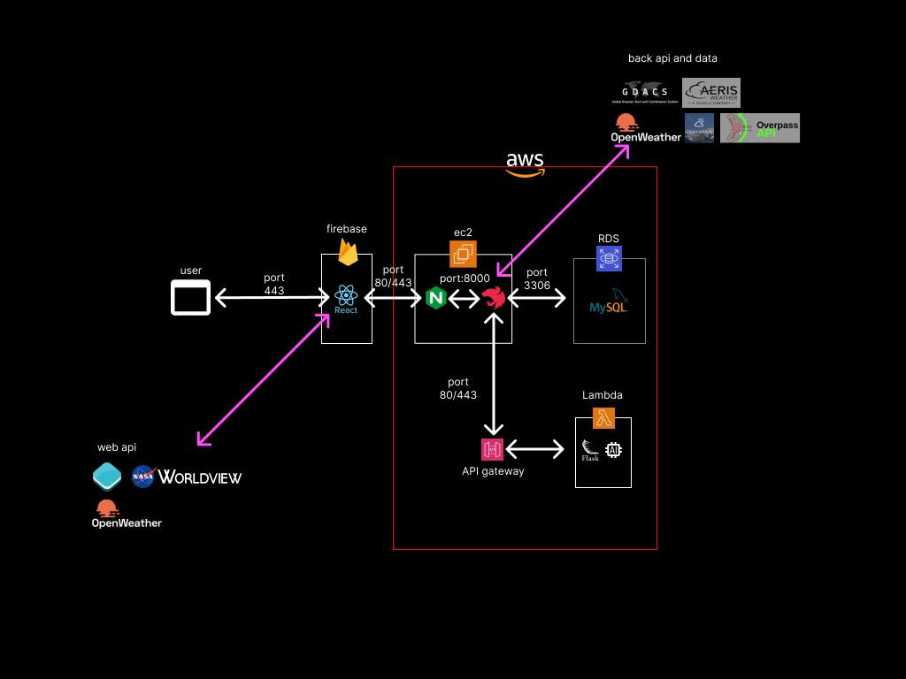

## Objective

---

SRT - Stop Right There은 태풍 경로 예측 모델을 활용한 태풍 정보 제공 및 알림 서비스입니다.

태풍 발생 현황을 실시간으로 수집하여, 예측 정보 및 알림 서비스를 제공합니다.

또한 위치 좌표를 활용하여 날씨 및 지역 정보를 제공합니다.

## SKILL

---

### STACKs

- NestJS
- Prisma
- Redis
- MySQL
- cheerio
- AWS
    - Lambda
    - EC2

### APIs

- openweathermap
- open-meteo
- GDACS
- aerisweather
- Overpass
- NAVER CLOUD PLATFORM(SENS)

## ARCHITECTURE

---

## DETAILS

---

### Typhoon

- 태풍 조회

  → 기간별 태풍을 반환합니다

- 태풍 상세 조회
- 태풍 이벤트
    - typhoon.GDACS.updated

      → GDACS의 업데이트 된 정보를 파싱하여 가져옵니다

      → 이후, 날씨정보를 수집후 태풍예측을 요청합니다.

      → 태풍예측 경로에 따라 알림서비스를 진행합니다.

    - typhoon.aerisweather.updated

      → aerisweather의 업데이트 된 정보를 파싱하여 가져옵니다

      → 이후, 날씨정보를 수집후 태풍예측을 요청합니다.

      → 태풍예측 경로에 따라 알림서비스를 진행합니다.

### Weather

- 도시 조회
- 좌표별 도시 리스트 조회
- 날씨 조회
    - 좌표로 도시 이름을 파악합니다.
    - start_date, end_date, period, forecast_days와 같은 쿼리들을 이용해 날씨 데이터를 불러오는 기간을 설정합니다.
    - 날짜마다 해당 date와 city 정보가 담겨있는 ‘yyyy-mm-dd-city’ 형식의 key로 저장되어 있는 데이터가 있는지 확인합니다.
        - 해당 key로 저장되어 있는 데이터가 있다면
            - redis cacheManager로 날씨 데이터를 불러옵니다.
        - 데이터가 없다면
            - open-meteo api를 이용해 해당 날짜와 필요한 데이터들을 가져와 저장해줍니다.

### SMS

- 문자 발송
    - 사용자의 전화번호를 받아, 사용자의 정보와 태풍 정보를 담아 태풍 알림 문자를 발송합니다.

    